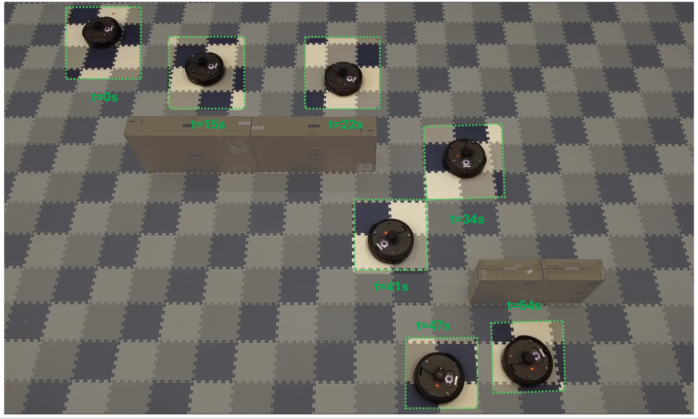

# RL-Navigation

This repository is an extended version of the [OmniIsaacGymEnvs](https://github.com/isaac-sim/OmniIsaacGymEnvs) repository, incorporating reinforcement learning for mobile robot navigation using 2D LiDAR. It is intended for use with Isaac Sim version 2022.2.1.

## Installation


Follow the Isaac Sim [documentation](https://github.com/NVIDIA-Omniverse/OmniIsaacGymEnvs) to install the latest Isaac Sim release.


To install `omniisaacgymenvs`, first clone this repository:

```bash
git clone git@github.com:sahars93/RL-Navigation.git
```

Set a `PYTHON_PATH` variable in the terminal that links to the python executable, 

```
alias PYTHON_PATH=~/.local/share/ov/pkg/isaac_sim-*/python.sh
```

Install `omniisaacgymenvs` as a python module for `PYTHON_PATH`. Change directory to root of this repo and run:

```bash
PYTHON_PATH -m pip install -e .
```

## Training

cd to omniisaacgymenvs.

Traning in the static environment:

```bash
PYTHON_PATH scripts/rlgames_train.py task=Jetbot pipeline=cpu
```
For training in a dynamic environment, replace the task with jetbot_dynamic or create a new separate task. To train or test with a moving target, use the dynamic_target script.


## Exporting the neural network

Export the .pth model to onnx format

```bash
PYTHON_PATH scripts/rlgames_onnx_normalized.py task=Jetbot test=True checkpoint=CHECKPOINT_PATH pipeline=cpu
```
If using an LSTM layer during training, consider exporting the model with the "rlgames_onnx_lstm.py" script.


## Test in Gazebo

Install gazebo Turtlebot3 simulation package

```bash
cd ~/catkin_ws/src/
git clone https://github.com/ROBOTIS-GIT/turtlebot3_simulations.git
cd ~/catkin_ws && catkin_make
```
Change the min range (to 0.15) and the max range (to 1.5):

```bash
sudo nano /opt/ros/noetic/share/turtlebot3_description/urdf/turtlebot3_waffle.gazebo.xacro
```

Launch the TurtleBot3 World


```bash
export TURTLEBOT3_MODEL=waffle
roslaunch turtlebot3_gazebo turtlebot3_world.launch
```
Check the LiDAR configuration on your robot, ensuring that its position is correctly aligned and adjusted to match the scan points used during training.
To test the model in gazebo run the ROS NODE.

```bash
python3 ROS/gazebo_test.py
```

Testing with LSTM model:

```bash
python3 ROS/gazebo_test_lstm.py
```

## Test in RealWorld

To test it with a real robot, one only needs to run the following node: 

```bash
python3 ROS/real_test.py
```

Note that there are several parameters that need to be set correctly:
- make sure that the subscriber topics are set correctly, you can use either odometry or PoseStamped for calculating the distance and angle to the target.

- You can find all other onnx models used in the paper in the folder ```/onnx_models```. 

- if the model uses lstm, set the parameter to True.
    ```python
    self.lstm = True
    self.lstm_hidden_size = 128
    ```
- define the lidar settings, and adjust the lidar position according to the train robot.:
    ```python
    self.lidar_samples = 120
    self.max_range = 2.5 
    self.min_range = 0.20 

## RealWorld results with Turtlebot 4 Lite



